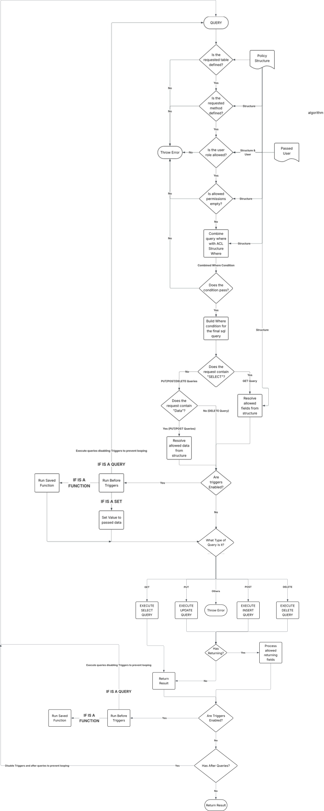

# Polaris

## Policy-Driven SQL Handler

**Polaris** is a declarative, database-level authorization and query engine built on **Node.js**. It combines:

* Role-based access control
* Field-level permissions
* Row-level filtering
* Payload-aware validation
* Conditional logic (IF / AND / OR)
* Dynamic joins
* Workflow/state transition enforcement
* Order and Group by
* Before and after triggers which can change passed data, run queries and user functions
* Bulk inserts

Polaris compiles structured request definitions into **safe SQL queries**, enforcing complex business rules directly at the database level.

---

## ✨ Features

### 1. Declarative Authorization DSL

Define permissions using structured JSON instead of imperative code. Supports:

* `AND` / `OR`
* Conditional `IF / ELSE`
* Subqueries
* Session variables (`$user`)
* Payload references (`$data`)

---

### 2. Role-Based Access Control (RBAC)

Per-role configuration:

```ts
{
  type: "PUT",
  user: { allowed: {...}, disallowed: [...] },
  admin: ALL,
  guest: NONE
}
```

Roles can define:

* Allowed fields
* Disallowed fields
* Row-level constraints
* Operation restrictions

---

### 3. Payload-Aware Validation

Unlike traditional RLS systems, Polaris can validate **incoming mutation data**:

```ts
if: {
  when: {
    left_value: "$data.table.field",
    operator: "IS NOT",
    value: null
  },
  do: where_condition,
  else: other_where_condition
}
```

Enables rules such as:

* Only allow updates if new value matches previous state
* Validate transitions
* Restrict changes conditionally

---

### 4. State Transition Enforcement

Polaris compares:

* Existing row values
* Incoming mutation payload
* User/session data
* Incoming mutation where condition fields

Use cases:

* Workflow progression validation
* Approval chains
* Business rule enforcement

---

### 5. Dynamic Query Builder

Supports structured query definitions:

```ts
{
  table: "orders",
  type: "GET",
  select: [
    "orders.*",
    "users.email"
  ],
  join: [
    {
      table: "users",
      on: { "orders.user_id": "users.id" },
      type: "INNER"
    }
  ]
}
```

Generates SQL:

```sql
SELECT orders.*, users.email
FROM orders
INNER JOIN users
  ON orders.user_id = users.id
```

All joins and filters are validated and secured.

---

### 6. Row-Level Enforcement in SQL

Rules compile directly into SQL `WHERE` clauses and joins:

* No post-filtering
* No in-memory filtering
* Enforcement happens inside the database
* Reduces bypass risk

---

### 7. Field-Level Control

Define which fields can be:

* Selected
* Inserted
* Updated
* Deleted
* Returned

Per role, per operation:

```ts
allowed: {
  field: ["type", "hours_worked"],
  where: {...}
},
disallowed: ["id", "user_id"]
```

---

## 🧠 Architecture

```
API Request
     ↓
Policy Handler (DSL Evaluation)
     ↓
SQL Query Builder
     ↓
Database
```

Handler steps:

1. Parses structured request input
2. Applies role-based policies
3. Injects row-level conditions
4. Validates payload constraints
5. Generates final SQL query
6. Executes safely

Flowchart:


---

## 🚀 Why Polaris Exists

Traditional solutions:

* Database RLS → Cannot inspect payload
* GraphQL permission engines → Limited conditional logic
* Middleware RBAC → Often evaluated outside SQL

Polaris enables:

* Payload-aware authorization
* Business workflow validation
* Join-aware access control
* Declarative rule definition
* Centralized policy enforcement
* Api level triggers

---

## ⚖️ Comparison to GraphQL Engines (e.g., Hasura)

| Capability              | Polaris                  | Typical GraphQL Engine |
| ----------------------- | ------------------------ | ---------------------- |
| Payload-aware rules     | ✅                        | ❌                      |
| State transition checks | ✅                        | ❌                      |
| Conditional IF logic    | ✅                        | ❌                      |
| Dynamic joins           | ✅                        | Limited                |
| SQL-level enforcement   | ✅                        | ✅                      |
| GUI / metadata tooling  | ⚠️ Coming in future SaaS | ✅                      |

---

## 🛡 Security Model

* All queries are compiled through policy rules
* Field access is explicitly controlled
* Row filters are injected at SQL level
* Payload comparisons prevent illegal state transitions

Security relies on **all database access going through the handler** and no raw SQL bypass routes.

---

## 📦 Example Use Cases

* Approval workflows
* Multi-role SaaS backends
* Business-rule-heavy APIs
* Systems requiring state transition validation

---

## 👥 Who We Are

We are a small team of three:

* Two software engineers focused on backend architecture, database systems, and API infrastructure
* One commercial specialist focused on product strategy, business development, and market positioning

Our goal is to simplify complex backend problems while remaining secure, scalable, and easy to integrate.

---

## 🎯 What We Built Polaris For

Polaris addresses recurring problems in API development:

* Scattered authorization logic across application code
* Difficulty enforcing complex business rules at the database level
* Lack of payload-aware authorization in most RBAC/RLS systems
* Fragile APIs with hard-to-maintain rules

Polaris centralizes **authorization and validation logic** in a declarative format, making APIs:

* More stable
* Safer
* Easier to modify
* More maintainable

---

## 🔮 Future Plans

Polaris will evolve into a **SaaS platform** with:

* Policy management interface
* API integration tooling
* Authorization visualization
* Query and rule debugging tools
* Real time policy editing without restart need

**Subscription model:**

* Free tier for experimentation
* Developer plans for startups and indie builders
* Advanced plans for production SaaS applications

**Open-source code:** Polaris is fully open source and self-hostable. Users may modify and host the project freely.

---

## 💬 Community & Feedback

We value feedback on:

* Architecture decisions
* Policy DSL design
* Real-world use cases
* Missing features

Your input will help shape Polaris’s future.

---

## 📄 License

[License](https://github.com/Zucchy00/Cerberus/blob/main/LICENSE)
